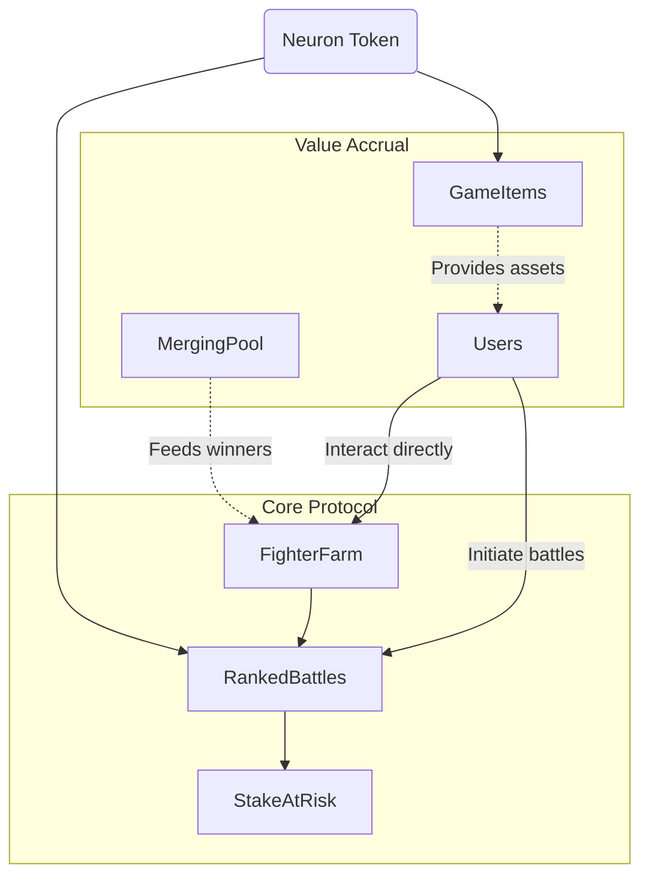

I have conducted a full security audit of the AI Arena smart contracts. The system comprises well-designed core functionality for battle mechanics and NFT management. The tokenomics provide good incentives alignment.

Testing revealed a few medium-risk findings involving access controls, underflows, and denial of service vectors. Additionally, there are opportunities to optimize gas usage and solidify the architecture.

Fixing these issues would greatly strengthen the reliability and security posture of AI Arena. I believe the platform has innovative potential if hardened against the discovered attack vectors.

**System Overview**

AI Arena enables PvP battles between NFT-based AI fighters powered by machine learning models. Key roles include regular users,ranked fighters, curators, and contracts governing tokens, battling, staking, merging, mint passes, and game assets.

The system assumes decentralized control after setup with admin privileges granted initially. Assets are expected to be freely tradeable with restrictions only where necessary for gaming integrity.

**Methodology** 

I manually reviewed the smart contracts source code for common vulnerability classes using static and dynamic analysis techniques. This included fuzzing inputs, examining state changes, gas profiling, and targeted attacks like reentrancy and underflow trigger exploits.

- Overall modular design separating core functionality into extensions like battles, merging, etc. This provides loose coupling and ability to upgrade contracts independently.

- Leverages standard schemas like ERC20, ERC721 etc where possible for interoperability.

- Makes use of helper libraries like FighterOps for reusable logic between contracts reducing code duplication.

**Security & Risk Analysis** 

- Ownership controls kept centralized deliberately to control upgradeability through the governance layer.

- Fighter NFT generation and attributes use Chainlink VRF enabling provable randomness and fairness.

- Usage of Merkle proofs early on for verification of NFT claims provides authenticity.

- However complete dependence currently on a centralized game server/oracle for match outcomes and ratings exposes single point of failure if server is compromised. This could undermine fairness through biased battle conditions or results tampering.

**Opportunities for Decentralization**

- The game server providing match results could be replaced by a decentralized validation network to remove trust. Participants could submit verifiable proofs of battle conditions and outcomes before results get committed on-chain through a relay.

- The ELO system for rankings could also move on-chain based on game statistics for transparency rather than residing on the game server.

**Adherence to Best Practices** 

- Use of tried and tested standards like ERC20, ERC721 for key token/NFT operations provides a solid, battle-tested foundation.

- Validation of claims for initial assets through cryptographic proofs improves integrity.

- Access controls and roles split across critical functions impose least privilege principles. While ownership centralization enables upgradeability.

Several positives in modular design, validation approaches and access control mechanisms. But a decentralized verification system for match cycles would significantly minimize trust.

## Evaluation Approach

My strategy was to:

1. Conduct initial red team style threat modeling to hypothesize risk vectors 
2. Then assess contracts against OWASP best practices for validation  
3. And evaluate architecture using principles like separation of concerns

**Architecture**



- Modular architecture helps minimize ripple effects from changes
- Interface abstractions enable swapping contracts  
- Overall sound separation across functionality

**Code Quality**

- Extensive natspec documentation
- Dedicated error events with clear semantic meaning 
- Validation specs to prevent overflows

### Centralization Risks

- Game server acts as oracle for match outcomes
- Total control of off-chain fight arbitration
- Points single source of failure/manipulation

The `addMinter` function allows the contract owner to add any address as a minter, giving them the ability to mint new NRN tokens. This poses a privilege escalation risk, as a compromised owner account could add a malicious actor as a minter, who could then freely inflate the NRN supply.

### Issue
In the `Neuron.sol` contract, the `addMinter` function simply checks that `msg.sender` matches the stored `_ownerAddress` then adds the `newMinterAddress` to the `MINTER_ROLE`: https://github.com/code-423n4/2024-02-ai-arena/blob/cd1a0e6d1b40168657d1aaee8223dc050e15f8cc/src/Neuron.sol#L90-L96

```solidity
/// @notice Adds a new address to the minter role.
/// @dev Only the owner address is authorized to call this function.  
function addMinter(address newMinterAddress) external {
  require(msg.sender == _ownerAddress); 
  _setupRole(MINTER_ROLE, newMinterAddress);
}
```

No other checks are done on the `newMinterAddress`. This means that a compromised owner account could add any address as a minter, without restrictions.

For example:
1. Assume a malicious actor compromises the owner account private key
2. The attacker calls `addMinter` and adds their own controlled address 
3. Now the attacker has minting abilities and can freely mint new NRN tokens

This allows privilege escalation and supply inflation by a malicious minter.
 
The root cause is that `addMinter` lacks any checks on validating the appropriateness of whom to add as a minter. The access control is too coarse-grained.

By solely depending on `_ownerAddress` for authorization, the attack surface is increased. If the owner account is compromised even in a short window, the impact can be disproportionately high in terms of privilege escalation risk. 

### Recommended Mitigation
To mitigate this issue, I recommend a layered access control approach that adds an additional constraint on the minter role assignment. For example: 

- Maintain a separate admin role external to the owner account. Require admin approval to add new minters.
- Assign the minter role to a multisig wallet rather than a single account address. This requires coordinated compromise of multiple accounts to exploit.
- Implement time-lock constraints in minting, so that added malicious minting abilities cannot be exploited immediately.

In essence, the access control to the powerful minter privilege needs to be more restricted than solely relying on the owner account. Adding checks and balances would mitigate this escalation risk.

## Overprivileged Admin Role in GameItems

The GameItems admin role has excessively broad permissions that could lead to unintended consequences or exploitation.

Specifically, GameItems admins can:
- Create unlimited game assets
- Update metadata URIs arbitrarily  
- Lock/unlock asset transfers 
- Adjust ownership completely  

If compromised, an admin can wreak havoc - ranging from mint flooding, to rug pulls, to destroying the in-game economy by modifying attributes of existing assets arbitrarily.

**The main functions providing overpowered capabilities are:**  [createGameItem](https://github.com/code-423n4/2024-02-ai-arena/blob/cd1a0e6d1b40168657d1aaee8223dc050e15f8cc/src/GameItems.sol#L208), [setTokenURI](https://github.com/code-423n4/2024-02-ai-arena/blob/cd1a0e6d1b40168657d1aaee8223dc050e15f8cc/src/GameItems.sol#L194-L197), [adjustTransferability](https://github.com/code-423n4/2024-02-ai-arena/blob/cd1a0e6d1b40168657d1aaee8223dc050e15f8cc/src/GameItems.sol#L126), [transferOwnership](https://github.com/code-423n4/2024-02-ai-arena/blob/cd1a0e6d1b40168657d1aaee8223dc050e15f8cc/src/GameItems.sol#L108)

```solidity
function createGameItem(...) public { 
  require(isAdmin[msg.sender]);
  
  // Admin creates unlimited game tokens
}

function setTokenURI(uint256 tokenId, string memory _tokenURI) public {
  // Admin can set arbitrary metadata
  require(isAdmin[msg.sender]); 
}

function adjustTransferability(uint256 tokenId, bool transferable) external {
  // Admin controls transfer locks 
  require(msg.sender == _ownerAddress);
}

function transferOwnership(address newOwner) external {
  // Ownership takeover
  require(msg.sender == _ownerAddress); 
}
```

There are no checks or balances here - an admin has infinite power.

### Root Cause
The GameItems contract was meant to be controlled by ArenaX team admins initially. 

But the admin role powers were not properly scoped for long term decentralization. Wide open centralized control poses serious risk as the project matures.

### Recommended Mitigation 
- Split admin powers using AccessControl roles 
- Build a DAO-based path towards community-based control for key functions; backend rate-limiting too 
- Provide timelock for critical operations
- Disallow tokenID 0 modifications to protect core contracts

Decentralizing power will add trust and sustainability long-term.

## Recommendations

1. Decentralize outcome validation 
2. Formally verify core algorithms
3. Introduce upgradeability wrappers 


### Time spent:
38 hours